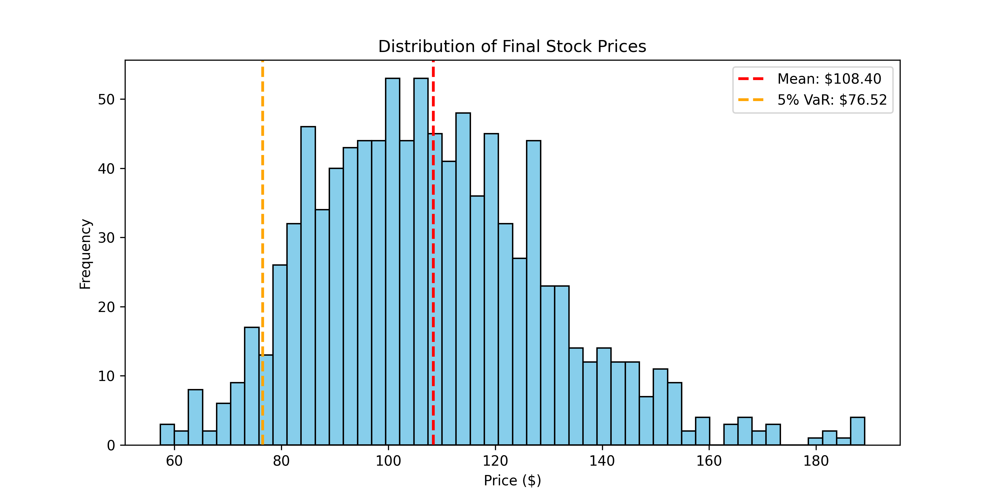

# 🎲 Monte Carlo Risk Simulator

> *Quantifying uncertainty with Stochastic Calculus.*


## 🧐 Overview
Predicting a specific future stock price is impossible. Predicting a **probability distribution** of future prices is science. This project uses Monte Carlo simulations to model thousands of potential market scenarios, allowing us to calculate **Value at Risk (VaR)**—a standard metric in institutional risk management.

## ⚙️ Methodology
We model stock price evolution using **Geometric Brownian Motion (GBM)**:

$$ dS_t = \mu S_t dt + \sigma S_t dW_t $$

*   **Drift ($\mu$):** The expected return over time.
*   **Shock ($\sigma dW_t$):** Random volatility component.

## 📊 Visual Analysis

### 1. The Multiverse (1,000 Simulations)
<p align="center">
  
  <br>
  <em>Figure 1: Visualizing the cone of uncertainty. Each line represents one possible future timeline.</em>
</p>

### 2. Probability Distribution & VaR
<p align="center">
  
  <br>
  <em>Figure 2: Distribution of final prices. The red dashed line indicates the 95% Value at Risk threshold.</em>
</p>

## 🚀 Usage
```bash
# Navigate to directory
cd monte_carlo_sim

# Run the simulation
python monte_carlo.py
```
