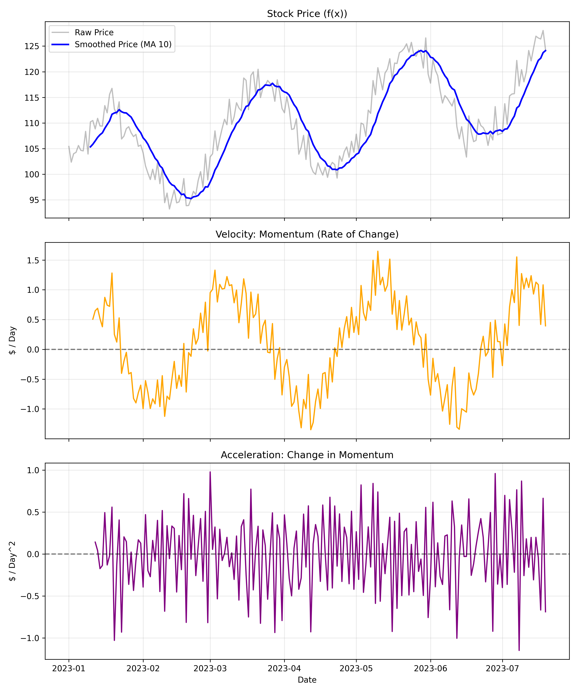

# 📉 Price Derivative Analyzer

> *Using Calculus to detect momentum shifts before they happen.*


## 🧐 Overview
Traders often look at price, but price is a lagging indicator. This project applies **Newtonian Physics** to financial markets by calculating the velocity and acceleration of price movements. The goal is to identify when a trend is "running out of gas" (negative acceleration) before the price actually reverses.

## ⚙️ Methodology
1.  **Signal Generation:** Created a synthetic price series with clear trends and reversals.
2.  **Calculus Application:**
    *   **Velocity ($v$):** The 1st derivative of price (Rate of Change).
    *   **Acceleration ($a$):** The 2nd derivative of price (Change in Rate of Change).
3.  **Smoothing:** Applied rolling averages to reduce noise and isolate the signal.

## 📊 Visual Analysis
<p align="center">
  
  <br>
  <em>Figure 1: Acceleration (Purple) acting as a leading indicator for Price (Blue). Note how acceleration turns negative before the price peak.</em>
</p>

### Key Insights
*   **Leading Indicator:** Notice the **purple line (Acceleration)** crosses zero and turns negative *while* the price is still rising.
*   **Physics of Finance:** Just like a ball thrown in the air slows down before it falls, a stock trend decelerates before it reverses.
*   **Practical Use:** This signal can help traders exit long positions early or prepare for short entries.

## 🚀 Usage
```bash
# Navigate to directory
cd price_derivative

# Run the analysis
python derivative_analysis.py
```
